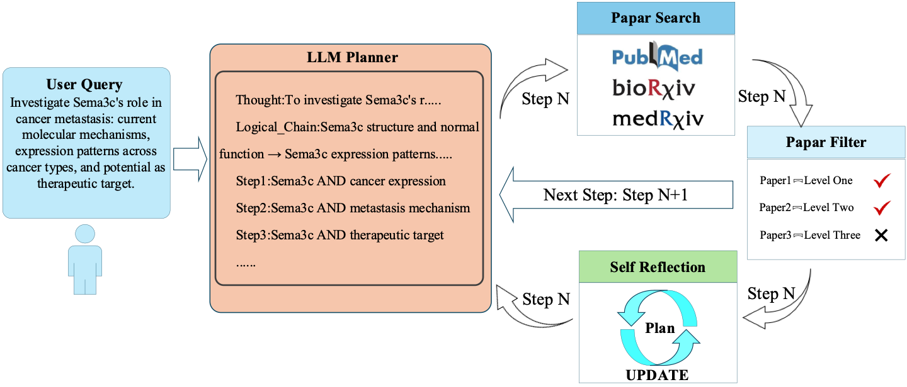
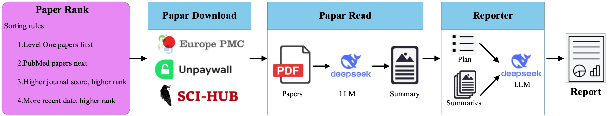

# 🧬 LitChain
> End-to-end Biomedical Literature Deep Research Agent Based on LangGraph  
> Input a research question → Automatically complete background research, study planning, literature retrieval, quality screening, full-text reading, and structured review report generation. Fully traceable, citable, and extensible.

---

## 🌟 Highlights
| Capability | One-line Description |
|---|---|
| 🔍 Multi-source Parallel Retrieval | Simultaneous search across PubMed / bioRxiv / medRxiv with millisecond response time. |
| 🧠 Intelligent Planning | LLM automatically breaks down open questions into chained research steps with self-correction support. |
| 📊 Three-tier Quality Screening | Automatic ranking by journal impact + time + relevance, filtering out low-quality literature. |
| 📄 Full-text Deep Reading | Auto PDF download (Europe PMC / Unpaywall / Sci-Hub) with LLM extraction of key findings. |
| 📝 Review Report Generation | Generate structured reports with citations and sections. |
| 🔁 Self-optimization | When all literature in a step is filtered out, system triggers reflection node to rewrite queries and re-search. |

---

## ⚙️ Prerequisites

### 1. Environment Setup
Create and activate Conda environment
```bash
conda env create -f environment.yml
conda activate LitChain
```

### 2. Set API Keys
```bash
# Method 1: Environment variable setup
export OPENAI_API_KEY="your-openai-api-key"
export OPENAI_API_BASE="https://api.openai.com/v1"
export TAVILY_API_KEY="your-tavily-api-key"

# Method 2: Configuration file setup
# Configure corresponding API keys and parameters in config.yaml
```

### 3. Set LANGSMITH Environment Variables (Optional)
Configure corresponding keys in .env file

### 4. Run the System
```bash
# Edit the question variable in run.py to set your research topic
python run.py
```

---

## Workflow

### Phase 1: Intelligent Retrieval and Screening


1. User input is first parsed by the LLM Planner, generating multiple research steps and corresponding query statements. For each step's query, the system simultaneously searches across three major databases: PubMed, BioRxiv, and MedRxiv.

2. For each retrieved paper, the system performs three-tier screening, retaining only literature that passes both first-tier and second-tier screening. If all papers in a particular step are filtered out, the system triggers a Self Reflection mechanism to automatically reflect on and update the query plans for that step and subsequent steps.

3. If papers in a step pass screening, the system proceeds to the next step, repeating the above process.

### Phase 2: Deep Analysis and Report Generation


4. After completing paper searches for all steps, the system ranks the retained literature from each step according to preset rules and selects the top N papers for download.

5. To ensure comprehensive and accessible literature acquisition, the system integrates three open access resources: Europe PMC, Unpaywall, and SCI-HUB, maximizing coverage of all downloadable paper versions and improving literature accessibility and utilization.

6. Subsequently, the system uses large language models to summarize each paper's content, extracting information highly relevant to the user's input. Finally, all step summaries are integrated according to the user's input and plan, with the large language model generating a complete review report.
